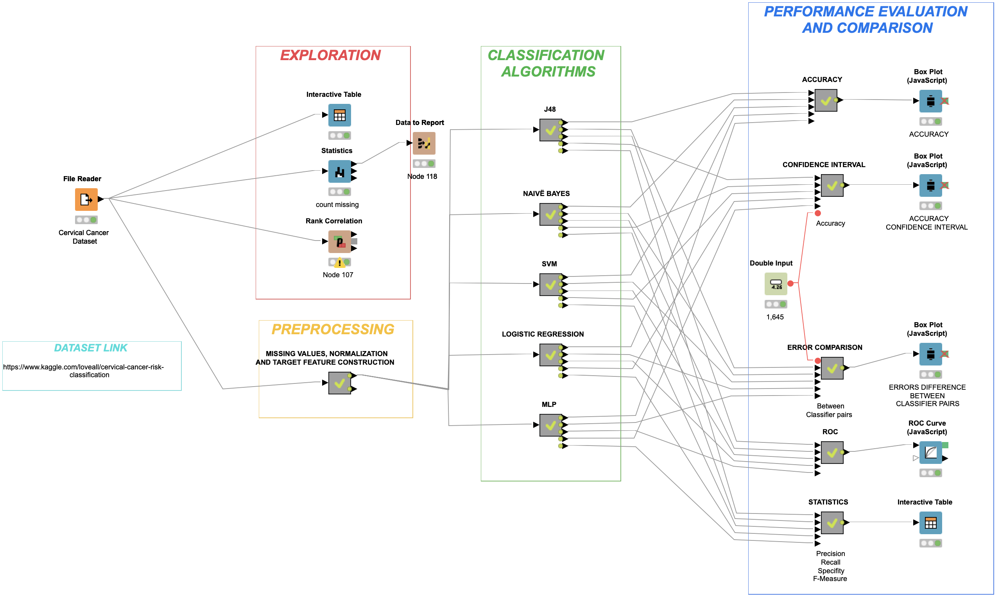

# Dataset-Cancer-Detection
In this paper we propose a Machine Learning classification models comparison based on a real case of data availability.

Cancer is a major cause of morbidity and mortality affecting population all around the world. Although cervical cancer is one of the most preventable diseases, it still has very high incidence rates in medium to low HDI countries. The main reasons for the higher incidence and mortality in developing countries are attributed to lack of awareness of cervical cancer, absence or poor quality of screening programmes and limited access to health care services. As other research has shown, we believe that Machine Learning has the potential to provide great low-cost aid in the early detection of cervical cancer to many medical structures around the world. In this paper we propose a Machine Learning classification models comparison based on a real case of data availability.

The dataset used for our analysis was obtained from the UCI repository and made available through the Kaggle platform (https://archive.ics.uci.edu/ml/datasets/Cervical+cancer+%28Risk+Factors%29). The analysis was conducted using the software Knime and in this paper we will refer to nodes and the relative properties we used.

